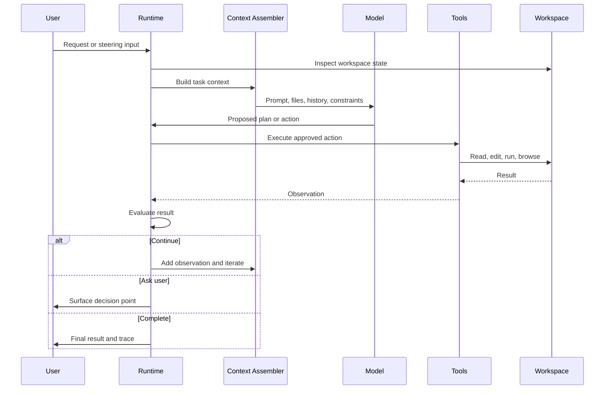

# Coding Agent Loop Diagram

## Generic Loop

## Execution Observations

- The runtime is the control surface; the model is not the whole agent.
- Context assembly is a loop boundary because it decides what the model can reason over.
- Tools convert model intent into observable state changes.
- Evaluation should use external evidence whenever possible.
- User control is part of the architecture, not an afterthought.

## Trace Refinements

- Add explicit retry and rollback paths.
- Add separate planning and execution model calls where systems support them.
- Add sandbox lifecycle events for hosted runtimes.
